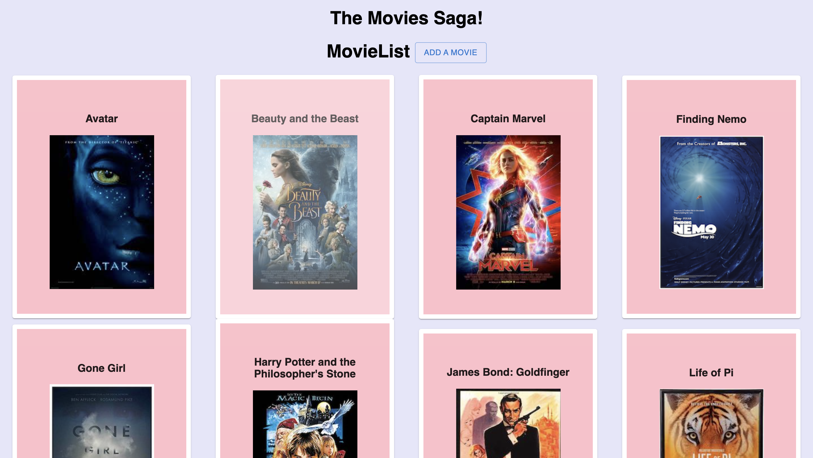
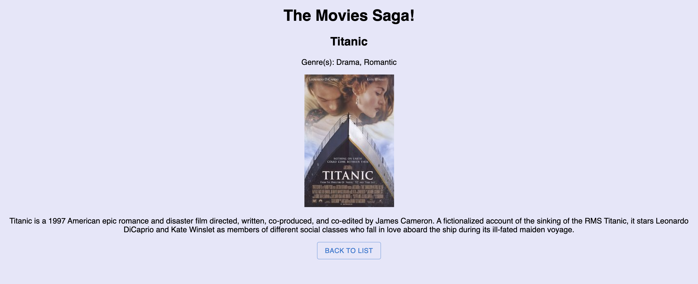
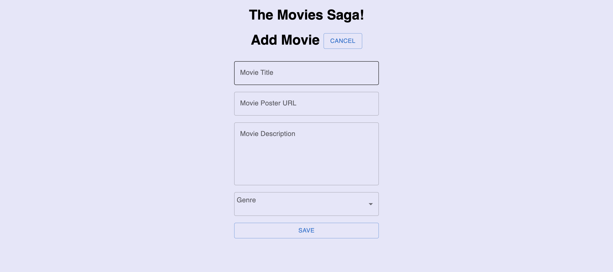

# Movie Saga List

## Table of Contents

- [Description](#description)
- [Screenshots](#screenshots)
- [Built With](#built-with)
- [Getting Started](#getting-started)
  - [Prerequisites](#prerequisites)
  - [Installation](#installation)
- [Usage](#usage)
- [License](#license)
- [Acknowledgements](#acknowledgements)
- [Contacts](#contacts)

## Description

This project was completed over the course of a weekend.

This is a web application that displays a list of movie titles, with each movie's poster featured along with it. The user can click on a movie to view the genres of the movie, and see the film's description as well.  The user is also able to add a movie to the list be clicking the 'Add a Movie' button on the home page. The user is then able to input the new movies title, poster URL, description, and can select a genre from the drop-down. Once the user clicks 'Save' the new movie will be added to the database, and rendered with the rest of the movies.

## Screenshots

## Built With

## Getting Started

The softwares listed above are necessary to run this app

### Prerequisites

Softwares used in creating this project includes: Visual Studio Code, PostgreSQL, and Postico

The project could require additional lines of code if used with alternative softwares.

### Installation

-Run "npm install" to install dependencies in this project.

-Run "npm server start" to start the server, which will run on port 5000.

-Run "npm client start" to start the client, which will run on port 3000.

-Running the client should open up a browser window to "localhost:3000" where you can view and use the app. You can also manually type in this address in your browser.

## License

<a href="https://choosealicense.com/licenses/unlicense/">The Unlicense</a>

## Acknowledgements

Thank you to Prime Digital Academy and all of my peers for all of the help they've given me.

## Contacts

  
